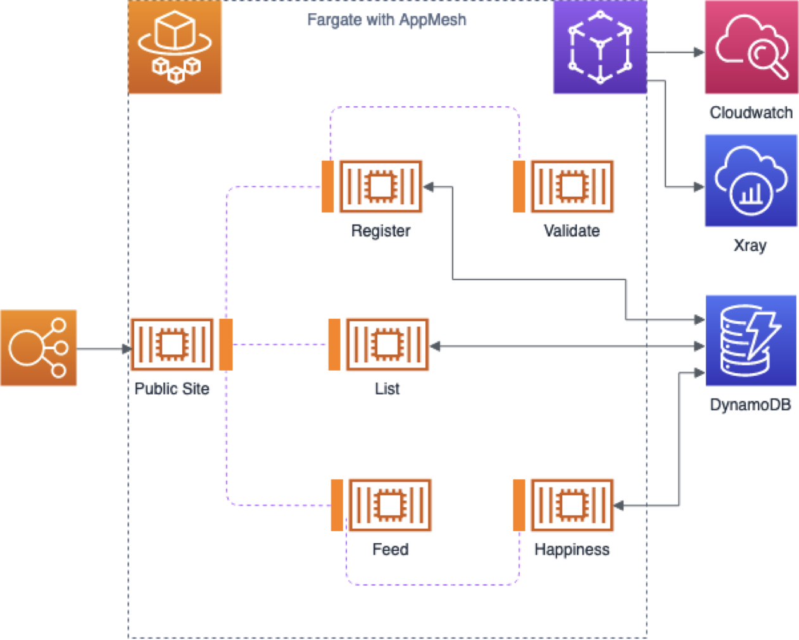

# Building observable applications on Fargate Workshop

This workshop is aimed at building an observable microservices Fargate application. It is based on the work done for a presentation given by Prateek Nayak and Arjen Schwarz titled "Keeping an Eye on your Serverless Containers" at Container Camp Australia in 2019. You can watch a recording, or read a textual version of the presentation [on Medium](https://medium.com/digio-australia/keeping-an-eye-on-your-serverless-containers-8a318e30b7a4).

This workshop will not cover the basics for Fargate. If you're not familiar with Fargate, it's recommended to go through earlier workshops that covered it such as [this one I've given in the past](https://github.com/ArjenSchwarz/workshop-fargate-bastion), or at least read up on the service. As the focus isn't on Fargate, but it's interaction with the other services, you will likely be able to follow along regardless of your knowledge though.

The end result of the workshop is you running a small application that you can monitor using various tools provided by AWS.

The application we're using for this is the same from the above mentioned presentation: Cuddle Kube. You can find the source code for the application [here](https://github.com/cuddlekube/application), and the source code for the original infrastructure (which is slightly modified for this workshop) [here](https://github.com/cuddlekube/infrastructure).

**Warning**: To make things a little easier, this workshop will spin up everything in public subnets and forego general security practices. As this is clearly for demo purposes, keep that in mind and don't use this as is for anything other than this demo.

## How to go through the workshop?

Each step has its own description file and directory full of files. Once you complete a step, you will find a link to the next step at the bottom.

While you are encouraged to build and experiment with many parts, a possible solution for each step is provided in the next step. While this might not be the exact solution you found, that doesn't make yours any less valid so feel free to continue using your working solution. The solutions provided in these steps will usually be in the form of CloudFormation templates.

Now, let's get you started with getting the basic setup done in [Step 1](step1.md).

## Requirements

* An AWS account

## Tools and services used

* CloudFormation
* VPC
* ECS Fargate
* DynamoDB
* CloudMap
* App Mesh
* Docker Hub (for the public images)

