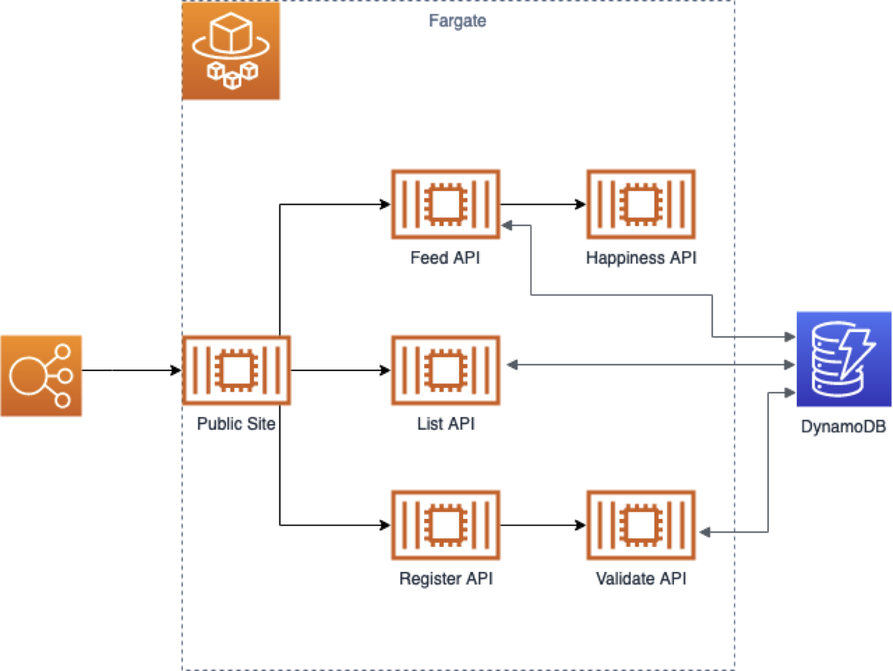
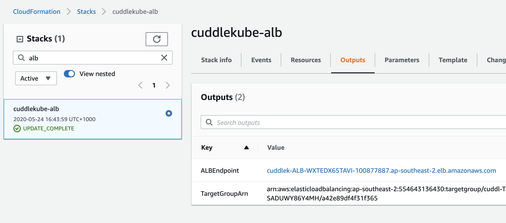
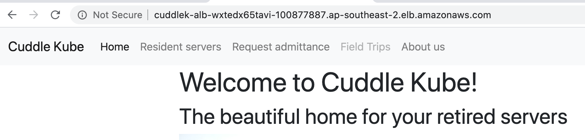

# Step 1: Setup

In this step we'll set up the basic requirements to run the application. While it's possible to do all of this manually, this is not the focus of the Workshop so CloudFormation templates to spin everything up are provided. This should bring us to an initial architecture as shown below.



The below shows how to run the various CloudFormation templates using the CLI. It is recommended that if you want to deploy this using CloudFormation you use the CLI as it is far easier, especially where it concerns the handling of parameters, however it is not required.

## ECS Cluster

Create a new ECS cluster named `cuddlekube`. This can be done using the `ecs-cluster.yml` CloudFormation template. From the command line you can run it using:

```bash
aws cloudformation create-stack --stack-name cuddlekube-ecs --template-body file://step1/ecs-cluster.yml --parameters file://step1/ecs-cluster-params.json --capabilities CAPABILITY_IAM
```

This creates the cluster that the Fargate tasks will run in when spun up as well as a couple of IAM Roles that will be required by the Fargate tasks. If you decide to create these roles manually, please ensure you store the ARN to them in the parameter store as you will need that later. To save yourself additional work later on, use the same names for the parameter store entries as in the template.

## DynamoDB table

The application requires a DynamoDB table to be set up. This is a simple one with a single key called `ckid`. Again, a CloudFormation template is available for this that you can run using:

```bash
aws cloudformation create-stack --stack-name cuddlekube-dynamodb --template-body file://step1/dynamodb.yml --parameters file://step1/dynamodb-params.json
```

This template creates a table in pay per request mode, ensuring it doesn't cost us money unless we actually use it. While we're at it, let's load some sample data in here.

```bash
aws dynamodb put-item --table-name cuddlykube --item file://step1/dynamo-data.json
```

## VPC and security group

Fargate containers need to run in a VPC, so we will create one. This is a public subnet only VPC to minimise costs for the demo, but keep in mind that running your entire application in a public subnet is a *bad idea*(tm). The provided CloudFormation template will create a VPC with 3 public subnets. Yes, technically speaking you can use the default VPC for this, but general best practice is not to use that VPC for anything and keeping it separate makes the cleanup easier.

```bash
aws cloudformation create-stack --stack-name cuddlekube-vpc --template-body file://step1/vpc.yml --parameters file://step1/vpc-params.json
```

This template will also create a security group to be used by the Fargate containers. The security group, VPC ID, and subnet IDs are all saved in the parameter store for later usage. Again, if you decide not to use the template for this, please make sure that the values are stored in the Parameter Store using the same names and types as the template would.

## Load Balancer

We will create an ALB that will serve as the entry point for our application. This is only configured to listen on port 80 and then forward all traffic to a target group that listens on port 8080. Again, for a proper setup you should use an SSL certificate and redirect all http traffic to https instead.

The ALB creation uses the VPC details that are stored in the parameter store. If you didn't use the provided templates please make sure you use the correct names for values in the parameter store, or update the `step1/alb-params.json` parameters file.

```bash
aws cloudformation create-stack --stack-name cuddlekube-alb --template-body file://step1/alb.yml --parameters file://step1/alb-params.json
```

*Note:* Instead of providing the VPC details in this way, we could instead have used [CloudFormation imports](https://docs.aws.amazon.com/AWSCloudFormation/latest/UserGuide/intrinsic-function-reference-importvalue.html). This wasn't used because it would force everyone to use CloudFormation for every step. Using the values stored in parameters has similar effects in making it easier to run, but doesn't have a CloudFormation dependency as these can be filled in other ways.

## Service Discovery (Cloud Map)

We will use service discovery in order to make the various microservices discover each other. The standard AWS tool for this is Cloud Map, which has integration with ECS to make things easier. Once again if you configured things manually you will need to update the parameter file before running the below command.

```bash
aws cloudformation create-stack --stack-name cuddlekube-cloudmap --template-body file://step1/cloudmap.yml --parameters file://step1/cloudmap-params.json
```

## ECS Task Definitions

Next we will need to create the task definitions for the various microservices. We will use a single template for this, but with different parameters for each microservice. The CloudFormation template will create a task definition as well as a parameter store object that stores the latest arn for the family.

As before, the parameter files will use some values from the parameter store and if you have done things manually you will need to update these.

```bash
aws cloudformation create-stack --stack-name cuddlekube-task-feed-api --template-body file://step1/ecs-task.yml --parameters file://step1/ecs-task-feed-api-params.json
aws cloudformation create-stack --stack-name cuddlekube-task-happiness-api --template-body file://step1/ecs-task.yml --parameters file://step1/ecs-task-happiness-api-params.json
aws cloudformation create-stack --stack-name cuddlekube-task-list-api --template-body file://step1/ecs-task.yml --parameters file://step1/ecs-task-list-api-params.json
aws cloudformation create-stack --stack-name cuddlekube-task-order-api --template-body file://step1/ecs-task.yml --parameters file://step1/ecs-task-order-api-params.json
aws cloudformation create-stack --stack-name cuddlekube-task-public-site --template-body file://step1/ecs-task.yml --parameters file://step1/ecs-task-public-site-params.json
aws cloudformation create-stack --stack-name cuddlekube-task-register-api --template-body file://step1/ecs-task.yml --parameters file://step1/ecs-task-register-api-params.json
aws cloudformation create-stack --stack-name cuddlekube-task-validate-api --template-body file://step1/ecs-task.yml --parameters file://step1/ecs-task-validate-api-params.json
```

## ECS Services

Time to start our application! You'll be familiar with the drill now regarding parameters, so you know whether you can just run the below commands or need to update parameter files.

```bash
aws cloudformation create-stack --stack-name cuddlekube-service-feed-api --template-body file://step1/ecs-service.yml --parameters file://step1/ecs-service-feed-api-params.json
aws cloudformation create-stack --stack-name cuddlekube-service-happiness-api --template-body file://step1/ecs-service.yml --parameters file://step1/ecs-service-happiness-api-params.json
aws cloudformation create-stack --stack-name cuddlekube-service-list-api --template-body file://step1/ecs-service.yml --parameters file://step1/ecs-service-list-api-params.json
aws cloudformation create-stack --stack-name cuddlekube-service-order-api --template-body file://step1/ecs-service.yml --parameters file://step1/ecs-service-order-api-params.json
aws cloudformation create-stack --stack-name cuddlekube-service-public-site --template-body file://step1/ecs-service.yml --parameters file://step1/ecs-service-public-site-params.json
aws cloudformation create-stack --stack-name cuddlekube-service-register-api --template-body file://step1/ecs-service.yml --parameters file://step1/ecs-service-register-api-params.json
aws cloudformation create-stack --stack-name cuddlekube-service-validate-api --template-body file://step1/ecs-service.yml --parameters file://step1/ecs-service-validate-api-params.json
```

And that's it! You now have a working cuddle kube application. If you go to the ALB's endpoint you can see the site running. The easiest way to do this is by going to the outputs of the ALB stack as that contains a link.





Now, the real fun is going to start so let's proceed to [Step 2](step2.md)!