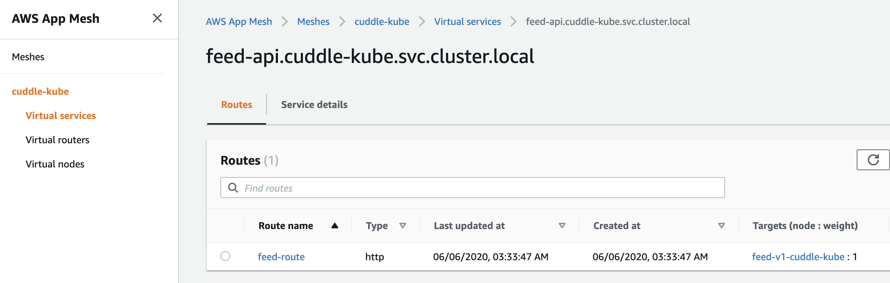
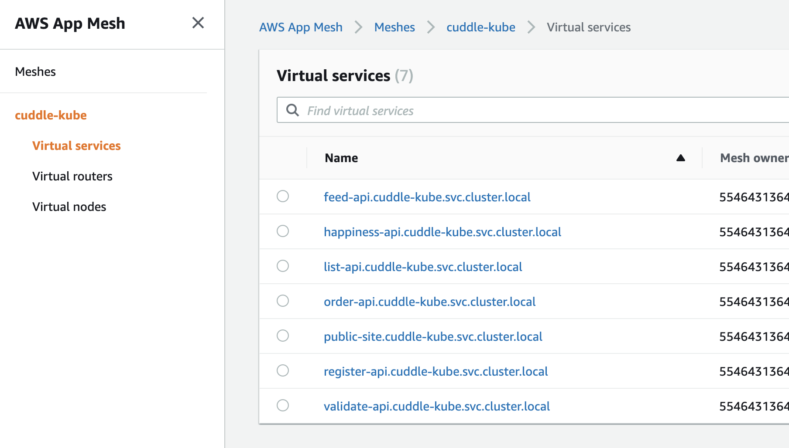
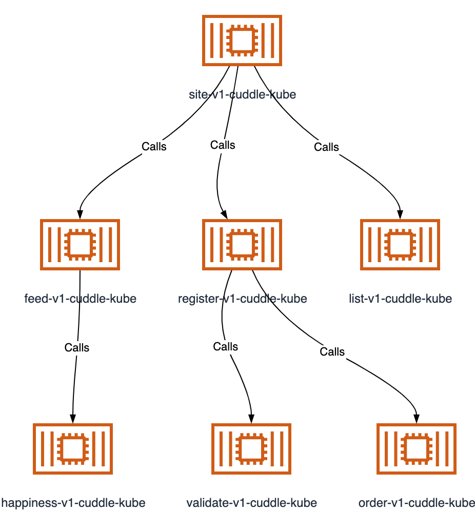
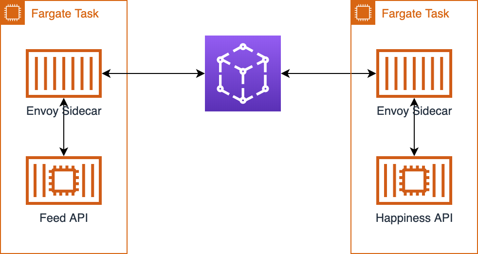

# Step 2: App Mesh

Now that we have a working site, let's get to the next step and add some mesh networking. This means that we'll switch the way the microservices connect to eachother from using hardcoded (through CloudMap) urls to ones that are managed by App Mesh.

As this is the part of the workshop where you'll be learning, feel free to play around instead of immediately using the templates provided in the step2 folder.

## Creating the Mesh

This part is pretty straightforward. As we did with the ECS cluster, we first need to create a mesh to use. As before, a CloudFormation template is provided for this.

```bash
aws cloudformation create-stack --stack-name cuddlekube-appmesh --template-body file://step2/appmesh.yml --parameters file://step2/appmesh-params.json
```

To remind you, as in step1 important outputs from the CloudFormation templates are stored in the parameter store so if you create things differently you can fill those and still use the following CloudFormation templates.

Created parameters:

 * `/cuddlekube/mesh` - contains the name of the mesh

## Adding services to the mesh

Now that we have a mesh to work with we need to add the various parts that reflect components of the mesh. There are 4 main components we need to set up for each of our services:

* Virtual Services
* Virtual Nodes
* Virtual Routers
* Virtual Routes

Let's give a short description of each of these. The below diagram from the [App Mesh user guide](https://docs.aws.amazon.com/app-mesh/latest/userguide/what-is-app-mesh.html) will serve as illustration.


A Virtual Service is the representation of your ECS/Fargate service endpoint in the mesh. This is what connections will be made to and so it will be taking the endpoint names.

Virtual Nodes are the actual representation of your ECS/Fargate service. If this sounds confusing to you, don't worry, it is. The easiest way to think about it is that the Service represents the endpoint you call, but you can have different versions of your service at the backend. You can connect a Node directly to a Service, but what you usually want to do is connect the two using a Virtual Router.

A Virtual Router allows you to direct traffic coming to a Virtual Service to different Virtual Nodes. So if you have different versions of the same service you can direct traffic to one service to use with Canary or blue/green style deployments. Additionally you can have the routes trigger on different properties like URL paths. That said, the Router itself is merely a container for the routes that determine this.

A Virtual Route is therefore where you determine how and when a Virtual Node is actually accessed.

So let's start with adding a single service so we can have a look.

```bash
aws cloudformation create-stack --stack-name cuddlekube-appmesh-structure --template-body file://step2/appmesh-structure-feed-only.yml --parameters file://step2/appmesh-structure-params.json
```

Now in the Console you can see that we have a feed api service with a routes that points at our node.



If you examine the node in more detail you will also notice that it uses DNS for the service discovery. It's also possible to use CloudMap directly, but doing so is left as an exercise for the reader as there were issues with that at the time this infrastructure was originally designed.

Now, we need all the other services to be in the app-mesh as well, including the connections between them. Let's take a moment to understand how those connections work. It should be clear that to call a service from within the mesh you do so using the name/domain of the service. In the case above, that would be `feed-api.cuddle-kube.svc.cluster.local`, but by default connections between Virtual Services will be denied. So you have to make sure these are enabled. Which you can by defining the `BackendServices` in the spec. In CloudFormation (using code from `step2/appmesh-structure.yml`) that can be defined as:

```yaml
        Backends:
          - VirtualService:
              VirtualServiceName: !GetAtt HappinessService.VirtualServiceName
```

Let's create all of this now with the below command:

```bash
aws cloudformation update-stack --stack-name cuddlekube-appmesh-structure --template-body file://step2/appmesh-structure.yml --parameters file://step2/appmesh-structure-params.json
```



Great! We've now got the entire mesh available! And while we can't see the connections easily in the Console, the below is generated using [a tool I wrote to help with things like this](https://github.com/ArjenSchwarz/awstools).



But, we're not done yet. Now we need to actually connect our Fargate services to this mesh as right now they don't know they should use it.

## Connecting Fargate to the Mesh



The way a task connects to App Mesh is by way of an Envoy container which is acting as a sidecar to the main application. This means that all traffic will go through this Envoy proxy. So in order to connect our services to the App Mesh, we will need to include this container and use it as a proxy in our task definitions before updating our ECS services to use the new definitions.

It is recommended to have a quick look at the CloudFormation template to see the differences, or do a comparison between it and the original.

```bash
diff -u step1/ecs-task.yml step2/ecs-task.yml
```

But let's update all our existing tasks now.

```bash
aws cloudformation update-stack --stack-name cuddlekube-task-feed-api --template-body file://step2/ecs-task.yml --parameters file://step2/ecs-task-feed-api-params.json
aws cloudformation update-stack --stack-name cuddlekube-task-happiness-api --template-body file://step2/ecs-task.yml --parameters file://step2/ecs-task-happiness-api-params.json
aws cloudformation update-stack --stack-name cuddlekube-task-list-api --template-body file://step2/ecs-task.yml --parameters file://step2/ecs-task-list-api-params.json
aws cloudformation update-stack --stack-name cuddlekube-task-order-api --template-body file://step2/ecs-task.yml --parameters file://step2/ecs-task-order-api-params.json
aws cloudformation update-stack --stack-name cuddlekube-task-public-site --template-body file://step2/ecs-task.yml --parameters file://step2/ecs-task-public-site-params.json
aws cloudformation update-stack --stack-name cuddlekube-task-register-api --template-body file://step2/ecs-task.yml --parameters file://step2/ecs-task-register-api-params.json
aws cloudformation update-stack --stack-name cuddlekube-task-validate-api --template-body file://step2/ecs-task.yml --parameters file://step2/ecs-task-validate-api-params.json
```

And then we'll update the services to use the latest version. As the template uses the `Latest` parameter for the task definitions, and we just updated that we can simply doing so by using the same template and parameters as in step1.

```bash
aws cloudformation update-stack --stack-name cuddlekube-service-feed-api --template-body file://step1/ecs-service.yml --parameters file://step1/ecs-service-feed-api-params.json
aws cloudformation update-stack --stack-name cuddlekube-service-happiness-api --template-body file://step1/ecs-service.yml --parameters file://step1/ecs-service-happiness-api-params.json
aws cloudformation update-stack --stack-name cuddlekube-service-list-api --template-body file://step1/ecs-service.yml --parameters file://step1/ecs-service-list-api-params.json
aws cloudformation update-stack --stack-name cuddlekube-service-order-api --template-body file://step1/ecs-service.yml --parameters file://step1/ecs-service-order-api-params.json
aws cloudformation update-stack --stack-name cuddlekube-service-public-site --template-body file://step1/ecs-service.yml --parameters file://step1/ecs-service-public-site-params.json
aws cloudformation update-stack --stack-name cuddlekube-service-register-api --template-body file://step1/ecs-service.yml --parameters file://step1/ecs-service-register-api-params.json
aws cloudformation update-stack --stack-name cuddlekube-service-validate-api --template-body file://step1/ecs-service.yml --parameters file://step1/ecs-service-validate-api-params.json
```

And now we're using App Mesh to direct our traffic. Play around with it a bit by doing things like changing routes in the mesh to confirm that it actually is using App Mesh. Unfortunately, we can't see much yet, so that's what we'll be addressing next.

Proceed to [step 3](step3.md).