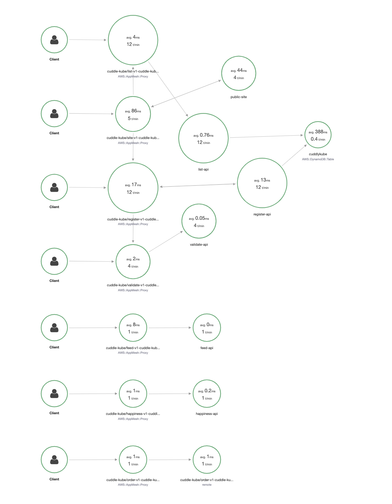

# Step 3: Enable monitoring

We want to be able to see everything that's going on. This means metrics, logs, and tracing. If you're familiar with ECS you may have already noticed we skipped some configuration steps in our rush to get tasks deployed. This was on purpose to show how hard it would be to figure things out if we don't have that.

## Metrics: Container Insights

Let's start with our metrics. Container Insights was released last year and allows us to have more detailed metrics about the containers running in our systems. Enabling this at the cluster level is easy, and we'll do it using CloudFormation again.

```bash
aws cloudformation update-stack --stack-name cuddlekube-ecs --template-body file://step3/ecs-cluster.yml --parameters file://step3/ecs-cluster-params.json --capabilities CAPABILITY_IAM
```

Now in the metrics part of your cluster you will see a link to take you to the Container Insights section of CloudWatch. As per this writing they are trialing a beta of the new interface, so it's possible you will need to click again to get there instead of the old interface. There is also a bit of a delay before metrics start showing up, so don't worry if you don't see anything yet. Just come back in a bit.

## Logs: CloudWatch Logs

The biggest missing item so far is the lack of logs. Especially with Fargate you can't just log into the instance and collect your logs. So because of this we'll need to enable logging for our containers. As we want to use the native functionalities we'll use CloudWatch Logs for this.

Again, this can be configured in CloudFormation. And let's start by actually creating our log groups for this.

```bash
aws cloudformation create-stack --stack-name cuddlekube-logs --template-body file://step3/loggroups.yml --parameters file://step3/loggroups-params.json
```

We have created 2 different log groups. One for our application logs and one for our VPC flowlogs. Together these two will be able to help us detect the actual issues we have.

Let's update our VPC to enable flowlogs:

```bash
aws cloudformation update-stack --stack-name cuddlekube-vpc --template-body file://step3/vpc.yml --parameters file://step3/vpc-params.json --capabilities CAPABILITY_IAM
```

Again, it can take a bit of time before you will see any logs start showing up.

In the meantime we can update our tasks as well. By now you know the drill, first update the task definitions.

```bash
aws cloudformation update-stack --stack-name cuddlekube-task-feed-api --template-body file://step3/ecs-task-logging-only.yml --parameters file://step3/ecs-task-feed-api-params.json
aws cloudformation update-stack --stack-name cuddlekube-task-happiness-api --template-body file://step3/ecs-task-logging-only.yml --parameters file://step3/ecs-task-happiness-api-params.json
aws cloudformation update-stack --stack-name cuddlekube-task-list-api --template-body file://step3/ecs-task-logging-only.yml --parameters file://step3/ecs-task-list-api-params.json
aws cloudformation update-stack --stack-name cuddlekube-task-order-api --template-body file://step3/ecs-task-logging-only.yml --parameters file://step3/ecs-task-order-api-params.json
aws cloudformation update-stack --stack-name cuddlekube-task-public-site --template-body file://step3/ecs-task-logging-only.yml --parameters file://step3/ecs-task-public-site-params.json
aws cloudformation update-stack --stack-name cuddlekube-task-register-api --template-body file://step3/ecs-task-logging-only.yml --parameters file://step3/ecs-task-register-api-params.json
aws cloudformation update-stack --stack-name cuddlekube-task-validate-api --template-body file://step3/ecs-task-logging-only.yml --parameters file://step3/ecs-task-validate-api-params.json
```

And then we'll redeploy the services so they will see the updated version.

```bash
aws cloudformation update-stack --stack-name cuddlekube-service-feed-api --template-body file://step1/ecs-service.yml --parameters file://step1/ecs-service-feed-api-params.json
aws cloudformation update-stack --stack-name cuddlekube-service-happiness-api --template-body file://step1/ecs-service.yml --parameters file://step1/ecs-service-happiness-api-params.json
aws cloudformation update-stack --stack-name cuddlekube-service-list-api --template-body file://step1/ecs-service.yml --parameters file://step1/ecs-service-list-api-params.json
aws cloudformation update-stack --stack-name cuddlekube-service-order-api --template-body file://step1/ecs-service.yml --parameters file://step1/ecs-service-order-api-params.json
aws cloudformation update-stack --stack-name cuddlekube-service-public-site --template-body file://step1/ecs-service.yml --parameters file://step1/ecs-service-public-site-params.json
aws cloudformation update-stack --stack-name cuddlekube-service-register-api --template-body file://step1/ecs-service.yml --parameters file://step1/ecs-service-register-api-params.json
aws cloudformation update-stack --stack-name cuddlekube-service-validate-api --template-body file://step1/ecs-service.yml --parameters file://step1/ecs-service-validate-api-params.json
```

If the running tasks don't seem to stop after a minute, please run the stoptasks script to force this.

```bash
bash stoptasks.sh
```

And now we can see our logs show up as well. At this point if you look at the logs you will see a lot of errors similar to `[Error] write udp 127.0.0.1:44418->127.0.0.1:2000: write: connection refused`. That is because the application is ready for the next part, although the rest of the stack isn't yet.

## Tracing: X-Ray

Tracing, or distributed tracing, allows us to follow a request all the way from start to the end. This is especially useful in a microservices architecture as it can help us pinpoint exactly where things are going wrong or are slower than expected. X-Ray is the service AWS offers for this and, in good news, it is actually integrated with App Mesh so things are easier.

This tracing is enabled at the task level again, so yes we will once again rebuild and redeploy our tasks and services. Adding X-Ray consists of 2 steps. First, we need to add an additional sidecar that runs the X-Ray daemon and secondly we'll need to run enable the Envoy proxy to use it as well. As mentioned, the application is already configured to use X-Ray, otherwise you would have needed to set that up too.

```bash
aws cloudformation update-stack --stack-name cuddlekube-task-feed-api --template-body file://step3/ecs-task.yml --parameters file://step3/ecs-task-feed-api-params.json
aws cloudformation update-stack --stack-name cuddlekube-task-happiness-api --template-body file://step3/ecs-task.yml --parameters file://step3/ecs-task-happiness-api-params.json
aws cloudformation update-stack --stack-name cuddlekube-task-list-api --template-body file://step3/ecs-task.yml --parameters file://step3/ecs-task-list-api-params.json
aws cloudformation update-stack --stack-name cuddlekube-task-order-api --template-body file://step3/ecs-task.yml --parameters file://step3/ecs-task-order-api-params.json
aws cloudformation update-stack --stack-name cuddlekube-task-public-site --template-body file://step3/ecs-task.yml --parameters file://step3/ecs-task-public-site-params.json
aws cloudformation update-stack --stack-name cuddlekube-task-register-api --template-body file://step3/ecs-task.yml --parameters file://step3/ecs-task-register-api-params.json
aws cloudformation update-stack --stack-name cuddlekube-task-validate-api --template-body file://step3/ecs-task.yml --parameters file://step3/ecs-task-validate-api-params.json
```

And then we'll redeploy the services so they will see the updated version.

```bash
aws cloudformation update-stack --stack-name cuddlekube-service-feed-api --template-body file://step1/ecs-service.yml --parameters file://step1/ecs-service-feed-api-params.json
aws cloudformation update-stack --stack-name cuddlekube-service-happiness-api --template-body file://step1/ecs-service.yml --parameters file://step1/ecs-service-happiness-api-params.json
aws cloudformation update-stack --stack-name cuddlekube-service-list-api --template-body file://step1/ecs-service.yml --parameters file://step1/ecs-service-list-api-params.json
aws cloudformation update-stack --stack-name cuddlekube-service-order-api --template-body file://step1/ecs-service.yml --parameters file://step1/ecs-service-order-api-params.json
aws cloudformation update-stack --stack-name cuddlekube-service-public-site --template-body file://step1/ecs-service.yml --parameters file://step1/ecs-service-public-site-params.json
aws cloudformation update-stack --stack-name cuddlekube-service-register-api --template-body file://step1/ecs-service.yml --parameters file://step1/ecs-service-register-api-params.json
aws cloudformation update-stack --stack-name cuddlekube-service-validate-api --template-body file://step1/ecs-service.yml --parameters file://step1/ecs-service-validate-api-params.json
```

If the running tasks don't seem to stop after a minute, please run the stoptasks script to force this.

```bash
bash stoptasks.sh
```

And now we can go see our traces in X-Ray! Let's have a quick [look there at the X-Ray Console](https://ap-southeast-2.console.aws.amazon.com/xray/home?region=ap-southeast-2#/service-map) and you will see something like the below.



This doesn't look quite right. Parts of it are useful, but it looks like everything in there is receiving frequent short calls. This is due to the health checks. While you can exclude those in the sampling rules, for this exercise we'll do it the easy way and just create a group to make it look better. For a real environment, please use proper sampling rules instead to prevent it from getting too expensive. However, that falls outside of this workshop.

In the dropdown that likely shows Default, there is an option to create a group. Select that and then use the below filter expression (or adjusted for your own if you made changes to the alb).

```
http.url BEGINSWITH "http://cuddlek-alb"
```

You can also do it from the CLI with the command:

```bash
aws xray create-group --group-name "cuddle-kube" --filter-expression "http.url BEGINSWITH \"http://cuddlek-alb\""
```


Much better! This also clearly shows us that all traffic does indeed go through the Envoy proxies from App Mesh so we definitely know that works.

But this also means we've now enabled detailed metrics, logs, and tracing for our Fargate application. How about we have a quick look to see how we can debug an issue?

Let's do so in [step 4](step4.md).
