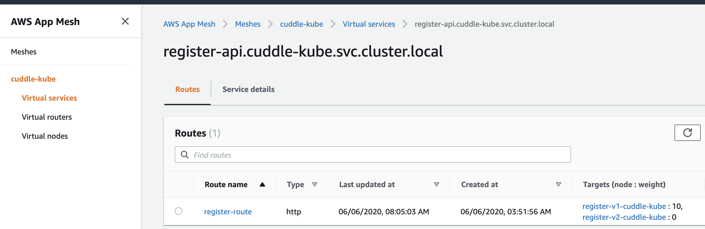
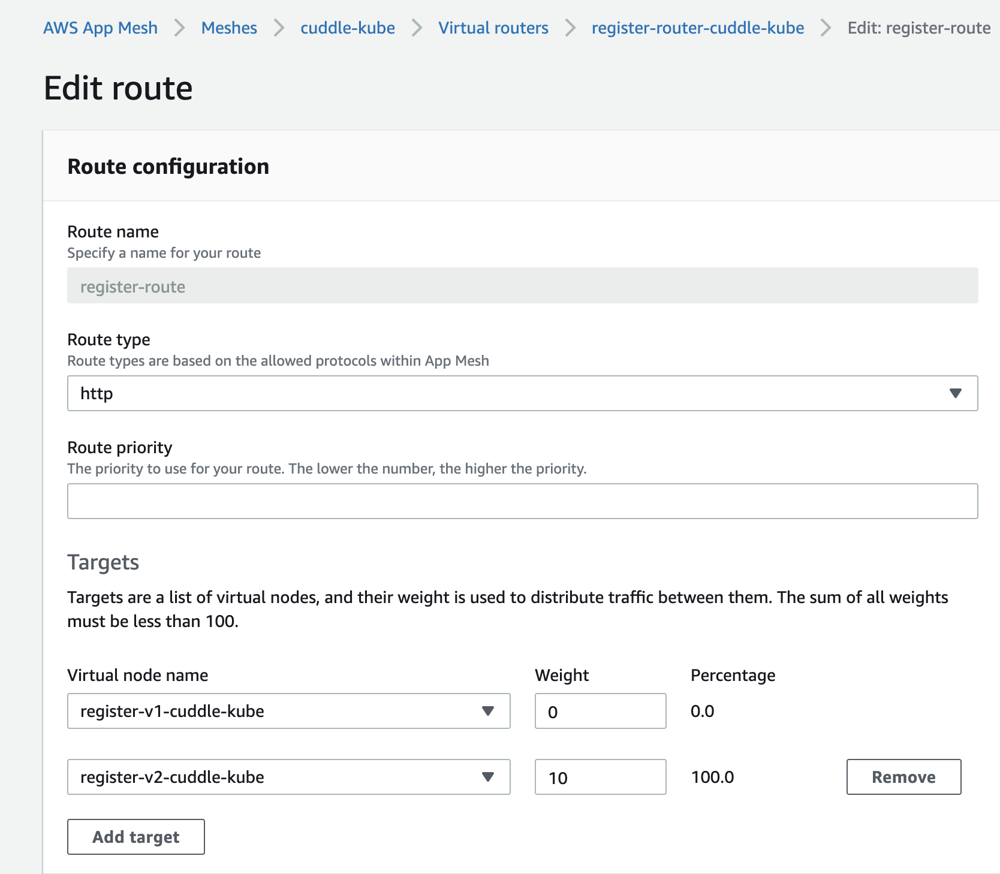
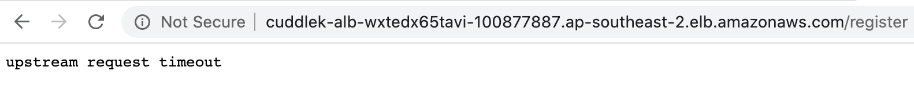

# Step 4: Debugging an issue

In order to have something to debug, we need to have something that actually fails. For this example, we'll use something that actually happened when building the demo that also displays something more about what we can do with App Mesh. Because we haven't really done anything with that yet. The process here may seem a bit convoluted, but that's mostly to make it easier to do the workshop. You should use a less cumbersome deployment process for your own environment.

## Introduce a new version of a container

One of our microservices has an update pending. But in order to make sure it stays secure, we don't want to just replace the existing one and hope for the best. So instead what we'll do is create a new service for it and attach that to App Mesh where we can then start switching over traffic when we're happy with it.

The service we want to update is our validation service. So, we'll create a new task definition for it as well as a new service.

We also run into one of the issues with App Mesh now. As before we can spin up the service we will need to make sure that App Mesh has the Virtual Nodes etc. ready. So we will first update our Mesh to include a v2 node, although we'll start out without giving it any traffic. If you compare the new template with the original, you will see that the changes are fairly minor. We only add a new Node and update the route to include it.

```bash
aws cloudformation update-stack --stack-name cuddlekube-appmesh-structure --template-body file://step4/appmesh-structure.yml --parameters file://step4/appmesh-structure-params.json
```

Then the new task definition

```bash
aws cloudformation create-stack --stack-name cuddlekube-task-register-api-new --template-body file://step4/ecs-task.yml --parameters file://step4/ecs-task-register-api-new-params.json
```

And finally the service

```bash
aws cloudformation create-stack --stack-name cuddlekube-service-register-api-new --template-body file://step4/ecs-service.yml --parameters file://step4/ecs-service-register-api-new-params.json
```

## Switch over to the new register API

Now, when we go to the App Mesh console and look at the register API we can see that it has 2 routes.



We are only using the first one so far, based on the weight, but we can manually switch this over by clicking on the route, and then editing it. Let's just completely switch over to the new version.



And then let's go back to our cuddlekube and try to sign up a new server.



If you get the above, you're receiving the expected error. Which then leads to the question. What do you do now?

A hint: find out what went wrong.

For a way to find the issue as well as other things you can do, go to the [final step](step5.md).