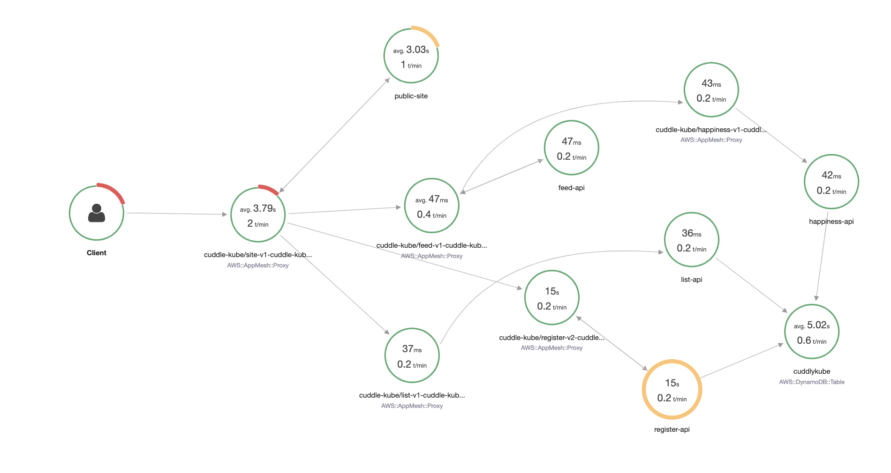
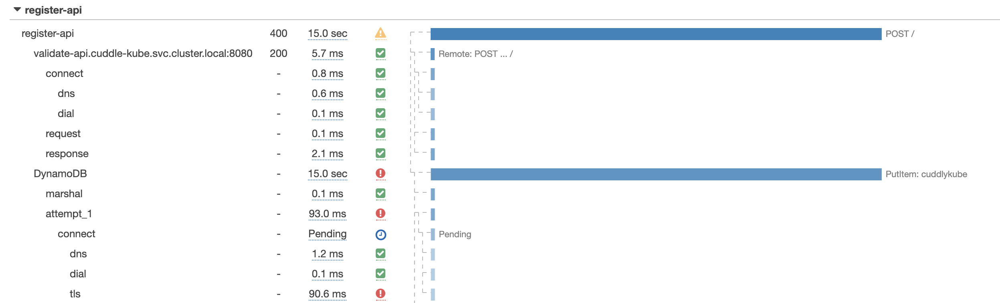

# Step 5: The end

## How to find what's wrong

Not unexpectly (as we already know what causes the problem) our solution here doesn't require all of the things we're observing. You can have a look to see if all the traffic goes through, look at the metrics, and go through all of the logs, but in this case the easiest way to quickly find the issue is to use X-Ray.



In X-Ray we can clearly see there is an issue with the registration API and clicking on it quickly shows what's actually going on.



It looks like there is an issue with the TLS connection to DynamoDB! If this was not a prepared failure, you would then likely look through the source code to find that someone accidentally deleted the installation of the `ca-certifications` in the container.

Now, while you were debugging you could have also already switched back to the working version of the microservice. You could have even switched to using different ways of routing, for example header based that would allow you to still try out the failed service while the rest of the world was happily using the original working one. And of course, you could have automated the whole deployment, including steps to switch back automatically when you encountered any issues.

## More things to play with

There are more things you can do with this workshop that aren't covered. Feel free to play around with it as much as you want, including with the original source code linked in the [README](README.md). Some ideas:

* Make the service discovery in App Mesh use native CloudMap instead of DNS
* Configure X-Ray so it doesn't try to log health checks
* Set up alarms based on metrics and logs
* Fix it so service updates don't require you to manually stop tasks

## Cleanup

The cleanup is straightforward if you did everything through CloudFormation and the below commands should get rid of everything for you.

### ECS services and tasks

If this takes long, you may want to stop the tasks manually again in the ECS cluster.

```bash
aws cloudformation delete-stack --stack-name cuddlekube-service-register-api-new
aws cloudformation delete-stack --stack-name cuddlekube-service-validate-api
aws cloudformation delete-stack --stack-name cuddlekube-service-register-api
aws cloudformation delete-stack --stack-name cuddlekube-service-public-site
aws cloudformation delete-stack --stack-name cuddlekube-service-order-api
aws cloudformation delete-stack --stack-name cuddlekube-service-list-api
aws cloudformation delete-stack --stack-name cuddlekube-service-happiness-api
aws cloudformation delete-stack --stack-name cuddlekube-service-feed-api
aws cloudformation delete-stack --stack-name cuddlekube-task-register-api-new
aws cloudformation delete-stack --stack-name cuddlekube-task-validate-api
aws cloudformation delete-stack --stack-name cuddlekube-task-register-api
aws cloudformation delete-stack --stack-name cuddlekube-task-public-site
aws cloudformation delete-stack --stack-name cuddlekube-task-order-api
aws cloudformation delete-stack --stack-name cuddlekube-task-list-api
aws cloudformation delete-stack --stack-name cuddlekube-task-happiness-api
aws cloudformation delete-stack --stack-name cuddlekube-task-feed-api
```

### ALB

```bash
aws cloudformation delete-stack --stack-name cuddlekube-alb
```

### App Mesh

```bash
aws cloudformation delete-stack --stack-name cuddlekube-appmesh-structure
aws cloudformation wait stack-delete-complete --stack-name cuddlekube-appmesh-structure && aws cloudformation delete-stack --stack-name cuddlekube-appmesh
```

### Cloud Map

Make sure the tasks and services are all gone first

```bash
aws cloudformation delete-stack --stack-name cuddlekube-cloudmap
```

### ECS

```bash
aws cloudformation delete-stack --stack-name cuddlekube-ecs
```

### DynamoDB

```bash
aws cloudformation delete-stack --stack-name cuddlekube-dynamodb
```

### VPC

```bash
aws cloudformation delete-stack --stack-name cuddlekube-vpc
```

### Logs

```bash
aws cloudformation delete-stack --stack-name cuddlekube-logs
```

### Leftovers

* Container insights creates a cloudwatch logs group that isn't automatically deleted. You will need to do so by hand, or leave it as the data in there is only kept for a single day.
* X-Ray traces are kept for 30 days, after which they will be deleted automatically. You don't pay for the storage of the traces, only for collecting and querying them. See the [X-Ray pricing guide](https://aws.amazon.com/xray/pricing/).
